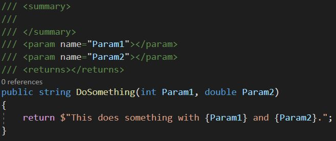
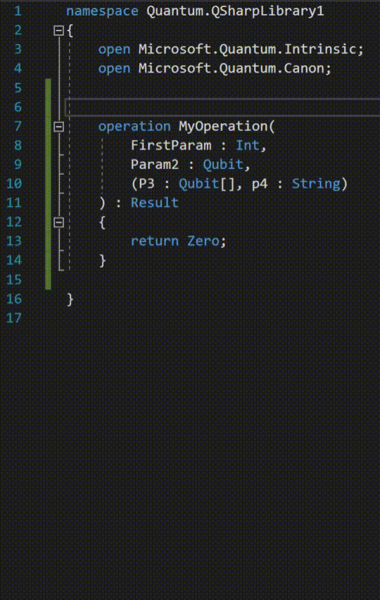
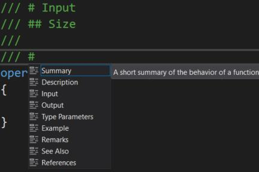

# Autogenerating Documentation Comments for Q# in Visual Studio

My name is Joe Clapis, and I've been a professional software engineer for about 10 years. For conventional projects in C#, C++, and
Python, Visual Studio is my IDE of choice. I like it because it offers a lot of utility that makes it fast and easy to write
high-quality code. As an example, good code should include extensive documentation for its functions. C# has XML-based documentation
comments baked into its spec, and Visual Studio can automatically create documentation stubs for you when you type three forward slashes
above a function:

The comment generator uses the C# parser to figure out what the names of your function's parameters are, and conveniently includes
properly-named sections for each of them in the XML comment. It also provides autocomplete support for additional tags you may want
to add, which it shows as soon as you start a comment line with the `<` character:

Though automatically generating comment stubs may not seem like a particularly important feature, I can assure you that manually writing
all of that XML by hand is a nuisance - especially for large functions with lots of parameters. Visual Studio's automatic stub
generation saves a lot of time in the long run because it takes care of the relevant formatting. I just have to fill in the blanks.
It's one of those little things that ends up making my development experience nicer overall.

For C++, this functionality isn't built into Visual Studio directly. It was sorely missed though, so a developer named **tcbhat**
went through the trouble of building an extension called [cpptripleslash](https://marketplace.visualstudio.com/items?itemName=tcbhat.CppTripleSlash-xmldoccommentsforc)
that adds it in. I've used this extension for over 3 years now for my C++ work, and since cpptripleslash has over 17,000 installs,
it's safe to say that I'm not the only one who finds it useful. 

## Q# and the QDK

At the beginning of 2019, my career took an interesting turn and I got the opportunity to work on software for quantum computers. After
doing a [fairly elaborate survey](https://github.com/jclapis/qsfe) of the various quantum software frameworks out there, I decided to use
Q# and the QDK for my algorithm design and development work. Quantum computing is one of those domains where your code can be very hard
to explain to other developers - especially if they aren't familiar with the theory behind what it does. This makes proper code
documentation *extremely important*; a properly documented function can save a lot of time and effort for both the maintainer and the user.

Unfortunately, the Visual Studio QDK extension doesn't provide the same autogeneration functionality for Q# that the IDE provides for C#.
To that end, I decided to take a page out of tcbhat's book and write an extension for Visual Studio that adds support for it. As a nod
to cpptripleslash, which inspired me to build it in the first place, I call it **QSharpTripleSlash**. You can find it in
[the Visual Studio Marketplace](https://marketplace.visualstudio.com/items?itemName=JoeClapis.QSharpTripleSlash), or take a look at
its [source repository on GitHub](https://marketplace.visualstudio.com/items?itemName=JoeClapis.QSharpTripleSlash).

QSharpTripleSlash brings Visual Studio's autogeneration of C# XML-based documentation comments to Q#'s Markdown-based comments.
It automatically starts up with Visual Studio, and will activate as soon as you open a `.qs` file. It works the same way as the native
C# generator so there's nothing new to learn. For example, typing a line with three forward-slashes above a Q# operation or function will
automatically produce the comment stub:

It can also create a small stub with a `# Summary` section for newtype declarations.

Pressing `Enter` in a triple-slash comment block will automatically add a new line that's been intented properly and starts with three
forward-slashes.

Finally, starting a triple-slash comment line with the `#` character will bring up an autocomplete menu with Q#'s supported Markdown
headers, just like C#'s autocomplete:

I've bundled a config file with it that lets you change various attributes, such as the number of empty lines that the extension adds
between sections or input parameter subsections when it generates the stub. 

If you're a Q# developer, consider giving it a try. It's very low overhead and totally free. Hopefully, it will make your life a little
bit easier while documenting your Q# code.
